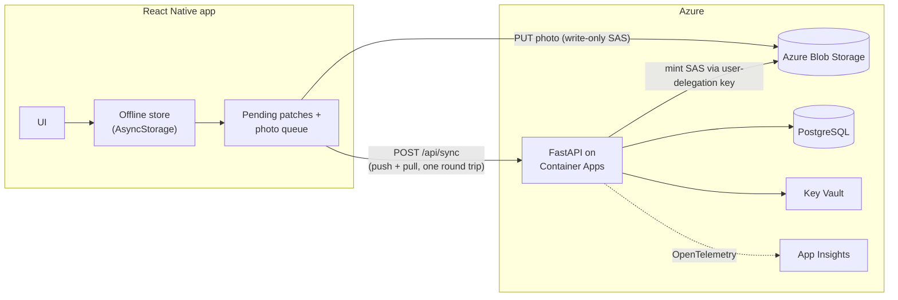

# SiteSync — offline-first field inspections

A production-style mobile + cloud system for inspectors working in basements, plant rooms and
rooftops where signal is unreliable. **The app is fully usable with zero connectivity** and
converges safely when it comes back — including when two devices edited the same record offline.

| Layer | Tech |
|---|---|
| Mobile | React Native (Expo), TypeScript strict, offline-first store, camera capture |
| Backend | Python 3.12, FastAPI, async SQLAlchemy 2, Pydantic v2, JWT auth |
| Cloud | Azure Container Apps, Blob Storage, PostgreSQL Flexible Server, Key Vault, ACR, App Insights (OpenTelemetry), Managed Identity |
| DevOps | Bicep IaC, GitHub Actions with OIDC (no stored cloud creds), pytest + jest |

## Architecture



## The interesting engineering

**Sync protocol** (`backend/app/services/sync.py`, mirrored in `mobile/src/sync/core.ts`)

* **Field-level last-writer-wins registers.** Each field carries the client's edit timestamp. Device A
  changes *severity* and device B changes *notes* while both are offline → both edits survive.
  Same-field collisions resolve deterministically and the loser is told (`conflicts[]`) so the UI can say so.
* **Monotonic per-user `seq` cursor** for pulls instead of "updated since timestamp" — immune to clock skew
  and to the classic missed-row-at-the-boundary bug.
* **Idempotent pushes.** Retrying a request after a dropped connection is a no-op (no version churn).
* **Photos merge as a grow-only set**, deletes are replicated tombstones.
* **In-flight edit safety.** If the user keeps typing while a sync request is in flight, only the
  acknowledged field versions are cleared from the queue; newer keystrokes are preserved and re-overlaid so
  the UI never flickers back to stale data (`applyServer`, covered by unit tests).
* **Poison-pill isolation.** A single invalid field is rejected and reported; it never blocks the batch or the queue.
* IDs are generated on the device, so *creating* records works offline.

**Photos never touch the API server.** The API mints a 5-minute, single-blob, write-only SAS from a
*user-delegation key* (Managed Identity); the phone uploads straight to Blob Storage. The storage account
has shared-key access disabled, so there is no account key to leak.

**Secure by default.** PBKDF2-SHA256 (310k iterations) password hashing, per-user data isolation enforced in
every query and covered by tests, tokens in the OS keychain (`expo-secure-store`), secrets only in Key Vault,
non-root container, OIDC deploys.

## Run locally

```bash
# API (SQLite + local photo storage, no Azure needed)
cd backend && pip install -r requirements.txt
python -m pytest            # 10 tests
uvicorn app.main:app --reload

# Mobile
cd mobile && npm install
npm test && npm run typecheck
npx expo start              # set expo.extra.apiUrl in app.json (10.0.2.2 for Android emulator)
```

## Deploy to Azure

```bash
az group create -n sitesync-rg -l uksouth
az deployment group create -g sitesync-rg -f infra/main.bicep \
  -p prefix=sitesync dbAdminPassword='<strong>' jwtSecret="$(openssl rand -hex 32)"
# then push to main: CI runs tests, builds the image in ACR, rolls a new Container Apps revision, smoke-tests /healthz
```

## Test coverage highlights

* `backend/tests/test_sync.py` — concurrent field merges, LWW conflict reporting, idempotency, set-merge photos,
  tombstones, bad-input isolation, cross-user isolation, auth.
* `backend/tests/test_uploads.py` — upload round trip, ownership/path-traversal guards.
* `mobile/src/sync/core.test.ts` — optimistic edits, in-flight edit preservation, conflict surfacing.

## Next steps (deliberately out of scope for v1)

Alembic migrations, Entra ID / B2C sign-in, push notifications via Azure Notification Hubs, PDF report
generation, per-org multi-tenancy, Azure OpenAI summaries of inspection notes.
